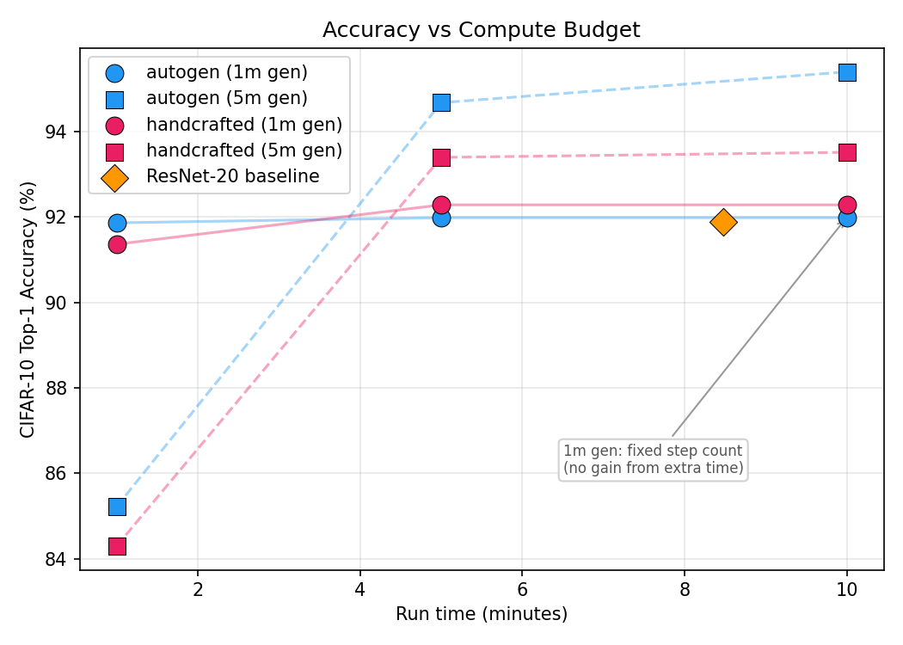
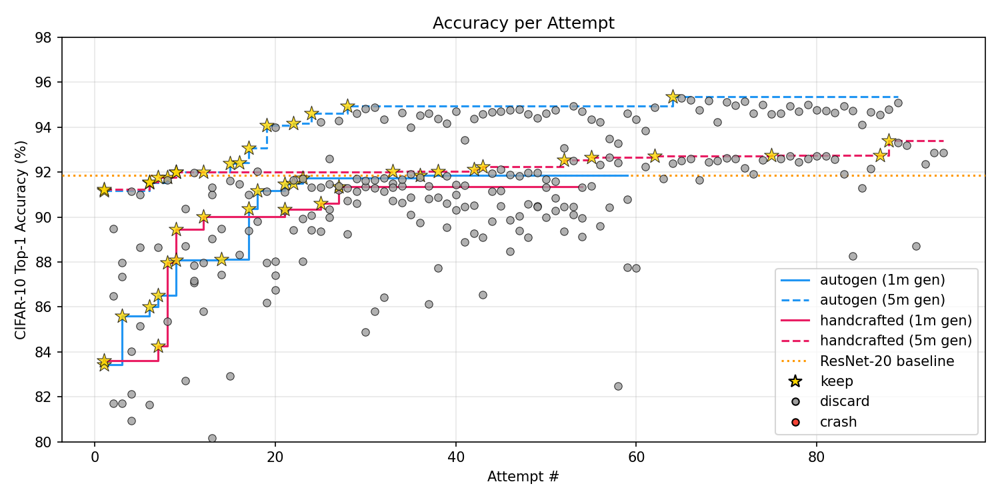

# autoresearch-cifar-10

An adaptation of Karpathy's [autoresearch](https://github.com/karpathy/autoresearch) repository applied on CIFAR-10 classification.
Starting from the Resnet paper I made the code as close as possible to the Resnet-20 setup and let Claude Opus 4.6 apply more modern techniques to boost performance. 
And yes CIFAR-10 makes it possible to run on any GPU and not just H100


## Results

Under this autoresearch paradigm you go from modifying your code to define a search space and define a grid-search or Bayesian search over it to defining a program.md and let the agent rip through your code. Ok, also first you need to define a time budget on each experiment step and modify your code to track it.
But this leaves you with only three hyperparameters to define: the model, the program.md, time-budget. For the model from all the discourse I have seen is that, the better the model the better the results. I would hazard to guess that specific agent that perform well on Data Science like benchmark 
[DABstep](https://huggingface.co/spaces/adyen/DABstep) might do better than Claude/Codex but for the sake of simplicity I used Claude Opus 4.6. For the **program.md** I tried to translate Karpathy's one **handcrafted** and an **auto-generated** one with Claude. For the training budget I decided to try **1** and **5** min on a 3090 which goes through 18 epochs/min on Resnet-20.







To complete the results I then reran them for 1/5/10 min to see if the setup would generalize. The first clear validated hypothesis with an enormous sample of two is that an auto-generated program.md seem to be more performant than my hand-crafted artisanal one.
They all beat the original ResNet-20 (91.89% / 8.5 min), from 91.36% for the 1-min handcrafted run (92.28% when given 5 min) up to 95.39% for the 5-min auto-generated one run for 10 min. Looking at what Claude decided to do (see folder ./search_results) it seems there is a pattern that emerges : 

1. The first move seem to replace the MultiStepLR scheduler to a CosineAnnealingLR or OneCycleLR. For that it needs to predict for how many epoch the program will run. Though it is not always successfully for the 1 min budget time and gets stuck on MultiStepLR.  
2. It understands clearly that with a better throughput the model can go through more steps and therefore get better result. The usual are tried then batch_size / torch.compile / bfloat16
3. Data-augmentation like Cutout is used first then more sophisticated one like Mixup, TrivialAugmentWide are tested later down the line
4. Bigger model are used but smaller alternative change yields better result like 1x1 conv on skip, ReLU to SiLU/GeLU swap. Strangely it stays on a ResNet like model, probably due to the readme talking about ResNet-20. This can be fixed via prompting.
5. It tries some optimizer change like AdamW, but results are rather poor compared to the trusted SGD
6. Label smoothing is a winner for all setups


## Learnings

After ~8h for each 5m training budget and ~1.5h for the 1m training budget the model will give up at around 70/90 tries and end by generating a nice table or paragraph explaining what it changed. This breaks the "loop forever" promise of the program.md, but is normal as LLM are trained to not output forever.
A simple heads up to continue will make it go again and a more definitive fix can be done with a simple script.  
What it tries during that time is really sensible, nothing breakthrough, and it never tries to go on the internet for ideas or to pick a better starting setup without prompting for it despite being mentioned in the program.md. A fun fact it did cheat on one of my run when it found a result.tsv and pick ideas from it. So if you run it, do it in a clean state.
I will more link the lack of breakthrough or exotic change to the starting setup. In the original autoresearch it leads to non-trivial improvements as its starting point was already well optimized. It also gives up pretty easily, as it drops his ideas after 2/3 tries at most. If you suggest via prompting it will go on for 10+ times before asking for some feedback. 
This is probably the killer feature of autoresearch having an (almost) tireless agent that can optimize not just parameters but your code for a few $/€ per hour.

## What could be improved

- The feedback for keep/discard model is only the test accuracy, this is definitely not enough. The typical loop for thinking what to test is next is by looking at complete plot, seeing over/under fitting or other issues.
- The experiment is biased to High LR which is normal for such small training budget but it might not be the best when giving full compute access. A fix could be to have a secondary validation on a 10/20 min run of the setup found.
- LOOOONNGGG running time. I stopped after the model said to stop, but it is fascinating to ponder what would those model do after 200/500/1000 run. Would they still find interesting thing or be stuck like they did when they played Pokemon and specific training or harness were necessary to fix that. 

## Setup

```bash
# Clone the repository
git clone https://github.com/GuillaumeErhard/autoresearch-cifar10.git
cd autoresearch-cifar10

uv sync
uv run pre-commit install
```

To avoid the agent to cheat by looking at this complete readme, switch to the branch with the program.md wanted.

```bash
git checkout auto-program
git checkout handcrafted-program
```

Choose your training time budget in prepare.py and commit the file. Make sure you have no previous result file in the folder. Then run your agent like Claude/Codex with a simple prompt like

```
Hi have a look at program.md and let's kick off a new experiment!
```

## Baseline: ResNet-20

The baseline model is a faithful implementation of the CIFAR-10 ResNet-20 from [He et al. 2015](https://arxiv.org/abs/1512.03385) (Section 4.2). The architecture, training schedule, and hyperparameters match the paper:

- 6n+2 = 20 layers (n=3), with filter widths {16, 32, 64}
- Identity shortcuts with zero-padding
- SGD with LR 0.1, momentum 0.9, weight decay 1e-4
- LR divided by 10 at 32k and 48k iterations, trained for 64k iterations
- Batch size 128, Kaiming initialization, no dropout
- Data augmentation: 4px padding + random 32x32 crop + horizontal flip

One minor deviation from the paper, following standard practice:

1. **Channel-wise mean** instead of per-pixel mean subtraction. The paper specifies a 32x32x3 mean image, but per-pixel mean doesn't align spatially after random cropping, making it semantically questionable under augmentation. Channel-wise mean is what later codebases (including the authors') converged on. But I decided to stick to per channel as it needs to be constant in eval.

Running this code gives a 91.89 % accuracy a bit better than the stated 91.25 %. But yes looking at this implementation there is a lot to squeeze with a more modern approach.
